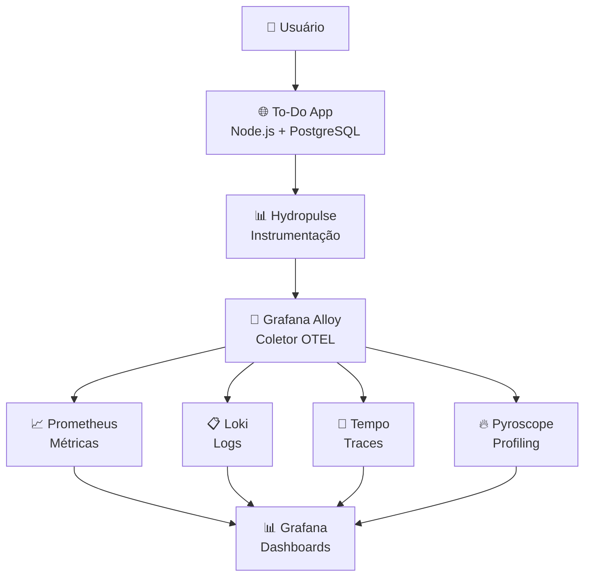

# 🌊 Hydropulse To-Do App - Complete Observability Demo

> **Demonstração completa dos três pilares da observabilidade usando Hydropulse, Node.js e Grafana Stack**

## 🎯 O que é este projeto?

Este é um **projeto educacional** que demonstra como implementar **observabilidade completa** em uma aplicação Node.js real usando a biblioteca Hydropulse. Através de uma aplicação simples de To-Do List, você aprenderá:

- 📈 **Métricas** - Como coletar e visualizar KPIs de negócio e técnicos
- 📋 **Logs** - Logging estruturado com correlação de traces  
- 🔗 **Traces** - Distributed tracing para entender o fluxo das requisições
- 🔥 **Profiling** - Análise de performance em nível de código

## 🏗️ Arquitetura da Solução



**Stack Tecnológico:**
- **Backend**: Node.js + Express + TypeScript
- **Database**: PostgreSQL 15
- **Telemetria**: Hydropulse (OpenTelemetry)
- **Coletor**: Grafana Alloy
- **Observabilidade**: Grafana, Prometheus, Loki, Tempo, Pyroscope

## 🚀 Início Rápido (5 minutos)

### Pré-requisitos
```bash
# Verificar se tem Docker instalado
docker --version
docker-compose --version

# Verificar se tem Node.js instalado
node --version
npm --version
```

### 1. Configurar e Executar
```bash
# 1. Navegar para o diretório do exemplo
cd examples/todo-observability

# 2. Instalar dependências
npm install

# 3. Copiar arquivo de ambiente
cp .env.example .env

# 4. Subir toda a stack de observabilidade (aguarde ~2-3 minutos)
docker-compose up -d

# 5. Aguardar todos os serviços ficarem prontos
docker-compose ps

# 6. Executar a aplicação
npm run dev
```

### 2. Acessar as Aplicações
| Serviço | URL | Credenciais |
|---------|-----|-------------|
| 🌐 **To-Do App** | http://localhost:3001 | - |
| 📊 **Grafana** | http://localhost:3000 | admin / admin |
| 📈 **Prometheus** | http://localhost:9090 | - |
| 📋 **Loki** | http://localhost:3100 | - |
| 🔗 **Tempo** | http://localhost:3200 | - |
| 🔥 **Pyroscope** | http://localhost:4040 | - |
| 🔄 **Alloy** | http://localhost:12345 | - |

### 3. Gerar Dados para Observar
```bash
# Criar algumas tarefas via API
curl -X POST http://localhost:3001/api/tasks \
  -H "Content-Type: application/json" \
  -d '{"title": "Estudar observabilidade", "description": "Aprender os três pilares"}'

curl -X POST http://localhost:3001/api/tasks \
  -H "Content-Type: application/json" \
  -d '{"title": "Configurar Grafana", "description": "Setup dashboards"}'

# Listar tarefas
curl http://localhost:3001/api/tasks

# Completar uma tarefa
curl -X PUT http://localhost:3001/api/tasks/{task-id}/complete

# Simular erros para demonstração
curl -X POST http://localhost:3001/api/simulate-error/db
curl -X POST http://localhost:3001/api/simulate-error/slow
curl -X POST http://localhost:3001/api/simulate-error/500
```

### 4. Explorar os Dashboards
1. **Acesse o Grafana**: http://localhost:3000 (admin/admin)
2. **Vá para Explore** → Selecione datasource
3. **Observe os dados** sendo coletados em tempo real

## 📊 O que você vai aprender?

### 📈 **Métricas - "O que está acontecendo?"**

A aplicação coleta automaticamente métricas como:

```typescript
// Métricas HTTP
http_requests_total          // Total de requests
http_request_duration_ms     // Duração das requests
http_errors_total           // Total de erros

// Métricas de Negócio
tasks_total                 // Total de tarefas
tasks_completed_total       // Tarefas completadas
tasks_pending_total         // Tarefas pendentes
tasks_created_total         // Tarefas criadas
tasks_deleted_total         // Tarefas deletadas
```

**Queries Prometheus:**
```promql
# Taxa de requests por segundo
rate(http_requests_total[5m])

# Percentil 95 de tempo de resposta  
histogram_quantile(0.95, rate(http_request_duration_ms_bucket[5m]))

# Taxa de erro da aplicação
rate(http_errors_total[5m]) / rate(http_requests_total[5m]) * 100

# Tarefas pendentes no sistema
tasks_total - tasks_completed_total
```

### 📋 **Logs - "Por que aconteceu?"**

Logs estruturados com correlação automática:

```json
{
  "level": "INFO",
  "message": "Task created: Estudar observabilidade",
  "attributes": {
    "operation": "create_task",
    "task_id": "123e4567-e89b-12d3-a456-426614174000",
    "task_title": "Estudar observabilidade"
  },
  "traceId": "abc123...",
  "spanId": "def456...",
  "timestamp": 1703123456789
}
```

**Correlação Automática**: Clique no `traceId` no log e vá direto para o trace!

### 🔗 **Traces - "Como aconteceu?"**

Distributed tracing automático para todas as operações:

```
📊 Exemplo de Trace Distribuído:

POST /api/tasks (250ms total)
├── Express Handler (200ms)
│   ├── Database Query (150ms) 
│   │   ├── Connection Pool (10ms)
│   │   ├── SQL Execution (130ms)
│   │   └── Result Processing (10ms)
│   ├── Business Logic (30ms)
│   └── Response Serialization (20ms)
└── HTTP Response (50ms)
```

## 🎮 Cenários de Demonstração

### 🟢 **Cenário 1: Operação Normal**
```bash
# Criar várias tarefas
for i in {1..10}; do
  curl -X POST http://localhost:3001/api/tasks \
    -H "Content-Type: application/json" \
    -d "{\"title\": \"Tarefa $i\", \"description\": \"Descrição da tarefa $i\"}"
done

# 👀 O que observar:
# ✅ Métricas de sucesso aumentando
# ✅ Traces limpos sem erros  
# ✅ Logs de nível INFO
# ✅ CPU usage normal no profiling
```

### 🔴 **Cenário 2: Simulação de Erros**
```bash
# Simular erro de banco de dados
curl -X POST http://localhost:3001/api/simulate-error/db

# Simular erro interno
curl -X POST http://localhost:3001/api/simulate-error/500

# 👀 O que observar:
# ❌ Métrica http_errors_total aumentando
# ❌ Traces com status ERROR  
# ❌ Logs de nível ERROR com stack traces
# ❌ Correlação entre logs e traces via traceId
```

### ⚡ **Cenário 3: Teste de Performance**
```bash
# Gerar rajadas de tráfego
for i in {1..50}; do
  curl -X GET http://localhost:3001/api/tasks &
done
wait

# 👀 O que observar:
# 📈 Picos nas métricas
# ⏱️ Aumento na latência (P95)
# 🔥 CPU spikes no profiling
# 🔗 Traces com maior duração
```

### 🐌 **Cenário 4: Operação Lenta**
```bash
# Simular operação lenta
curl -X POST http://localhost:3001/api/simulate-error/slow

# 👀 O que observar:
# 🐌 Traces com spans de alta duração
# ⏰ Histograma de latência com outliers  
# 🔥 Wait time no profiling
# 📋 Logs indicando operação demorada
```

## 🔍 Como Investigar um Problema Real

### 🚨 **Passo 1: Detectar**
1. **Dashboard de overview** mostra anomalia (ex: error rate alto)
2. **Métricas Prometheus** indicam problema
3. **Usuários reportando lentidão**

### 🔍 **Passo 2: Investigar**
1. **Métricas** → Identificar quando e onde o problema começou
2. **Logs** → Filtrar por ERROR/WARN no período afetado  
3. **Trace ID** → Copiar do log para investigação detalhada

### 📊 **Passo 3: Analisar Root Cause**
1. **Tempo** → Abrir trace específico usando traceId
2. **Span Analysis** → Encontrar span com erro ou alta latência
3. **Pyroscope** → Se for problema de performance, analisar profiling

### 💡 **Exemplo Prático:**
```
🔍 "Por que as requests estão lentas?"

1. Grafana Dashboard: P95 latency subiu de 100ms para 2s
   ↓
2. Prometheus: Problema começou às 14:30  
   ↓
3. Loki: Filtrar logs por timestamp e encontrar errors
   ↓
4. Trace: Copiar traceId de um log de erro
   ↓  
5. Tempo: Analisar trace → span "database_query" demorou 1.8s
   ↓
6. Root Cause: Query SQL específica está lenta
```

## 🛠️ Estrutura do Projeto

```
todo-observability/
├── 📝 src/
│   └── index.ts              # Aplicação principal Express
├── 🐳 docker-compose.yml     # Stack completa de observabilidade
├── ⚙️ config/
│   ├── alloy.yml            # Configuração Grafana Alloy
│   ├── prometheus.yml       # Configuração Prometheus
│   ├── loki.yml            # Configuração Loki
│   ├── tempo.yml           # Configuração Tempo
│   └── grafana/            # Datasources e dashboards
├── 📊 dashboards/           # Dashboards Grafana
├── 📦 package.json          # Dependências Node.js
├── 🔧 .env.example         # Variáveis de ambiente
└── 📚 README.md            # Esta documentação
```

## 🎯 Funcionalidades da Aplicação

### 🌐 **API REST** 
| Método | Endpoint | Descrição |
|--------|----------|-----------|
| GET | `/` | Informações da API |
| GET | `/health` | Health check |
| GET | `/api/tasks` | Listar tarefas |
| POST | `/api/tasks` | Criar tarefa |
| PUT | `/api/tasks/{id}/complete` | Completar tarefa |
| DELETE | `/api/tasks/{id}` | Deletar tarefa |
| POST | `/api/simulate-error/{type}` | Simular erros |

### 💥 **Tipos de Erro para Demonstração**
- **`db`** - Erro de banco (SQL inválido)
- **`timeout`** - Timeout simulado  
- **`500`** - Erro interno do servidor
- **`slow`** - Operação lenta (2-5s)

## 🔧 Configuração Avançada

### 📊 **Variáveis de Ambiente Hydropulse**

```bash
# Configuração do Serviço
HYDROPULSE_SERVICE_NAME=todo-observability-demo
HYDROPULSE_SERVICE_VERSION=1.0.0
HYDROPULSE_ENVIRONMENT=development

# Provider (alloy recomendado para stack completa)
HYDROPULSE_PROVIDER=alloy
HYDROPULSE_ALLOY_ENDPOINT=http://localhost:4318

# Configurações Opcionais
HYDROPULSE_DEBUG=true
HYDROPULSE_SAMPLING_RATE=1.0
HYDROPULSE_BATCH_SIZE=100
HYDROPULSE_BATCH_DELAY=5000
```

### 🐳 **Customizar Docker Compose**

Para ambiente de produção, ajuste:

```yaml
# docker-compose.override.yml
version: '3.8'
services:
  todo-app:
    environment:
      - HYDROPULSE_ENVIRONMENT=production
      - HYDROPULSE_DEBUG=false
      - HYDROPULSE_SAMPLING_RATE=0.1
  
  prometheus:
    volumes:
      - ./config/prometheus-prod.yml:/etc/prometheus/prometheus.yml
```

## 🔧 Troubleshooting

### ❌ **Aplicação não inicia**
```bash
# Verificar logs da aplicação
npm run dev

# Verificar PostgreSQL
docker-compose logs postgres

# Verificar Alloy
docker-compose logs alloy
```

### ❌ **Métricas não aparecem no Grafana**
```bash
# Verificar Alloy (coletor)
docker-compose logs alloy

# Verificar Prometheus
curl http://localhost:9090/api/v1/query?query=up

# Testar endpoint OTLP
curl http://localhost:4318/v1/metrics -X POST
```

### ❌ **Traces não aparecem no Tempo**  
```bash
# Verificar logs do Tempo
docker-compose logs tempo

# Verificar conectividade
curl http://localhost:3200/api/traces

# Verificar Alloy está enviando traces
docker-compose logs alloy | grep -i trace
```

## 🚀 Próximos Passos

### 📖 **Para Aprofundar Conhecimento**
- [ ] Configurar **alertas** no Prometheus/Grafana
- [ ] Implementar **SLI/SLO** dashboards  
- [ ] Estudar **sampling strategies** no tracing
- [ ] Explorar **custom metrics** de negócio
- [ ] Adicionar **cache layer** (Redis) com observabilidade

### 🏢 **Para Ambiente de Produção**
- [ ] Configurar **retenção** adequada de dados
- [ ] Implementar **high availability** dos componentes
- [ ] Adicionar **security** (TLS, autenticação)
- [ ] Configurar **backup** e **disaster recovery**
- [ ] Implementar **cost optimization**

### 🔬 **Para Experimentos Avançados**
- [ ] **Chaos Engineering** - Simular falhas reais
- [ ] **Synthetic Monitoring** - Testes automatizados
- [ ] **Multi-service tracing** - Adicionar mais serviços
- [ ] **Custom OpenTelemetry Collector** - Configurações avançadas

## 🎉 Conclusão

Este projeto é uma **implementação completa e realista** dos três pilares da observabilidade usando **Hydropulse e ferramentas modernas de mercado**.

**🎯 O que você consegue fazer após este projeto:**
- ✅ Implementar observabilidade em qualquer aplicação Node.js
- ✅ Usar Grafana Stack em produção
- ✅ Troubleshoot problemas usando traces correlacionados
- ✅ Criar dashboards efetivos para monitoramento
- ✅ Entender OpenTelemetry na prática

**💼 Skills desenvolvidas:**
- **Observabilidade** - Métricas, logs, traces, profiling
- **Grafana Stack** - Prometheus, Loki, Tempo, Pyroscope, Alloy
- **OpenTelemetry** - Instrumentação automática e manual
- **Troubleshooting** - Investigação de problemas em produção
- **Performance** - Análise e otimização de aplicações

---

**🚀 Pronto para começar? Execute os comandos do "Início Rápido" e comece a explorar!**

---

> 💡 **Dica**: Este projeto é opensource e está sempre evoluindo. Contribuições são bem-vindas!
